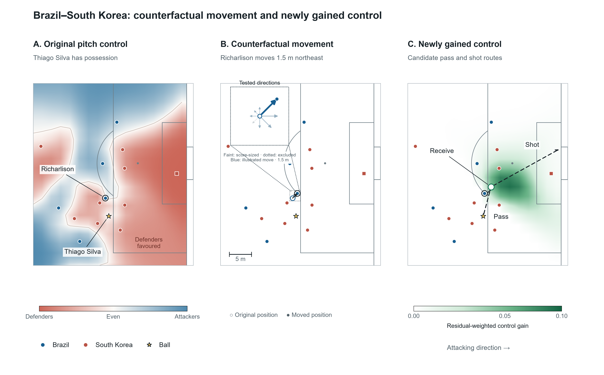
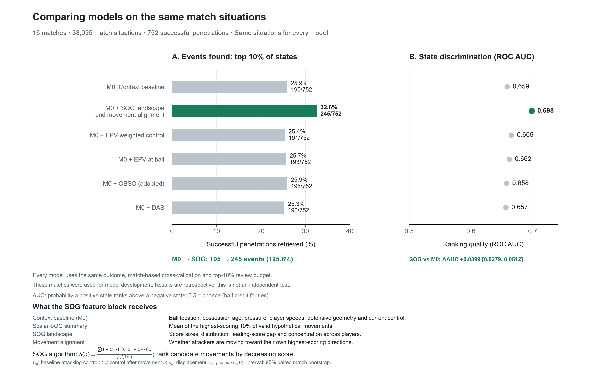

# Fragility Score

**Mapping counterfactual openings in soccer defenses.**

[](https://colab.research.google.com/github/AhmadEnan/fragility/blob/ssac27-abstract-v1.1.0/notebooks/reproduce_ssac27.ipynb)
[](LICENSE)

An organized defense can still offer an attacker a useful movement nearby. **Structural Opening Gain (SOG)** makes those opportunities visible: it scores small hypothetical movements, holds the other players fixed, and ranks the resulting gains in attacking control. This deterministic scoring algorithm has no learned scoring parameters.

This repository contains the SOG implementation, data-processing code and analyses needed to reproduce the findings. It includes cohort construction, event qualification, comparator extraction, classifier fitting and recovery of documented player actions. The research is described in the [SSAC 2027 abstract](docs/submission/ABSTRACT.md) and [figure captions](docs/submission/FIGURE_CAPTIONS.md).

## How SOG works

SOG compares attacking pitch control before and after a short hypothetical movement. It discounts gains in space the team already controls and divides by the distance moved. Repeating this calculation across players and directions gives an opening landscape.



In this Brazil–South Korea example, Richarlison moves 1.5 m northeast while everyone else stays fixed. The green field shows the resulting weighted control gain. The inset compares tested directions; dashed pass and shot routes illustrate static clearance, not predicted success.

## Reproduce the results

Open the Colab notebook and select **Runtime → Run all**. It checks the code and data hashes, refits the classifiers, recalculates the results and tactical recovery, and displays both figures. It uses the included derived data; no raw-data download, credentials or GPU are needed.

Locally, with Python 3.12 or newer:

```bash
python -m pip install -r requirements-reproduce.txt -e ".[test]"
python tests/verify_notebook.py
```

To start from tracking and event data, follow the [raw-data instructions](REPRODUCIBILITY.md#reconstruction-from-authorized-provider-data). You'll need access to the provider's dataset; the raw files stay on your computer.

## What the evidence shows

The opening landscape and its alignment with player movement add information to an observed-context classifier for **retrospective tactical review**.

| Evaluation | Common review budget | Observed-context baseline | Baseline + SOG landscape and alignment |
|---|---|---:|---:|
| Held-out: 16 matches, 38,751 situations | Top 10% of situations | 170 / 694 events | **220 / 694 events** |
| Held-out average precision | Same situations | 0.0482 | **0.0598** |
| Figure 2: 16 development matches, 38,035 situations | Top 10% of situations | 195 / 752 events | **245 / 752 events** |

The held-out increase is **29.4% more distinct qualified penetrations** at the same review budget. Figure 2 compares SOG with EPV at the ball, EPV-weighted control, adapted OBSO and dangerous accessible space on the same development cohort.

Separately, 13 externally documented tactical sequences provide 20 evaluable player–direction actions. SOG recovers **13/20**, compared with **11/20** for plain pitch-control gain. Pre-release recovery is 10/20 each; the two additional SOG recoveries occur after release. The case-bootstrap interval for the difference is 0–24 percentage points.



The scalar SOG summary alone adds essentially no held-out discrimination. The contribution is the **action landscape and movement alignment**. Centered velocities include subsequent positions, so these results support retrospective retrieval, without establishing live forecasting, causal movement effects or a universal defensive-quality scale.

## Code and documentation

| Topic | Files |
|---|---|
| SOG scoring and features | [Methods](METHODS.md), [solver](src/fragility/fast_sog.py) |
| Situation selection and penetration events | [Data pipeline](src/fragility/raw_pipeline.py), [CAP qualification](src/fragility/raw_cap.py) |
| Figure 2 comparators | [Comparator extraction](src/fragility/comparators.py), [settings](configs/literature_benchmark.json) |
| Documented player actions | [Ranking and recovery](src/fragility/tactical.py), [frame-level results](results/reproduced/tactical_frame_evidence.parquet) |
| Feature normalization and row mapping | [Input export](src/fragility/export_inputs.py), [row identities](data/identity/row_identity.parquet) |
| Reproduction checks and code origins | [Verification record](RELEASE_AUDIT.md), [source provenance](CODE_PROVENANCE.md) |

See [data access](DATA_ACCESS.md) for the dataset and sharing terms. The code is available under the [MIT license](LICENSE); [third-party notices](THIRD_PARTY_NOTICES.md) describe the external methods and EPV grid used here.
