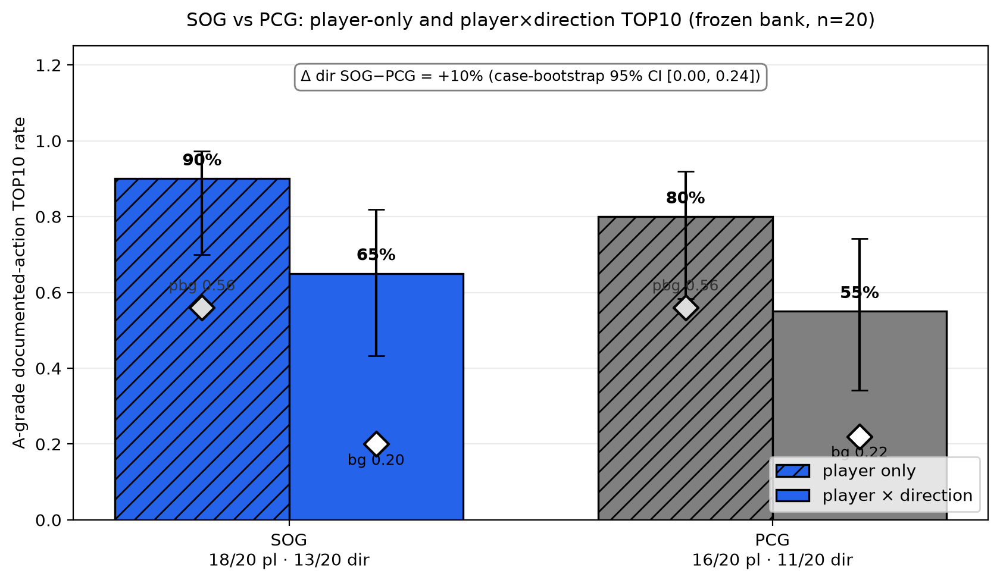
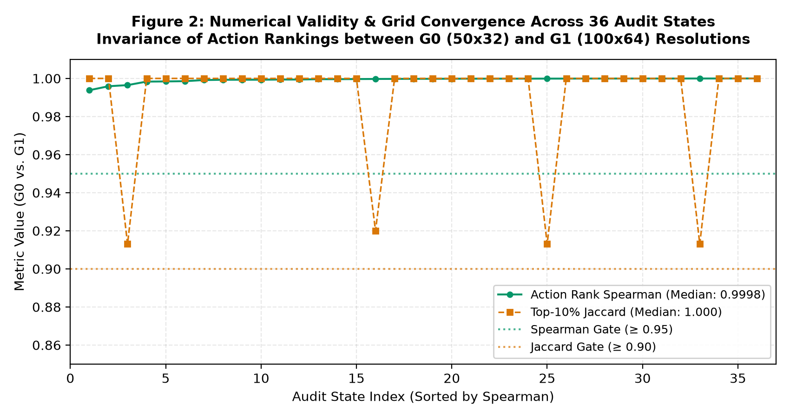

# One Meter from Trouble: Counterfactual Defensive Fragility from Player Tracking

[](https://colab.research.google.com/github/AhmadEnan/fragility/blob/main/notebooks/reproduce_ssac27.ipynb)
[](https://github.com/AhmadEnan/fragility/actions/workflows/tests.yml)
[](https://www.python.org/downloads/)
[](LICENSE)

> **Official Public Reproduction Package** — MIT Sloan Sports Analytics Conference 2027 (Soccer Track)

Modern pitch control models quantify spatial dominance in observed player configurations, but cannot measure how precarious a defensive structure is to subtle attacking adjustments. **`fragility`** evaluates **Structural Opening Gain (SOG)** by subjecting every off-ball attacker to an exhaustive grid of micro-counterfactual displacements ($\pm 0.5\text{ m}, \pm 1.0\text{ m}, \pm 1.5\text{ m}$ in 8 compass directions). Aggregating the tail (top 10%) of these counterfactual gains yields a scalar measure of macro defensive fragility ($F_{\text{SOG}}$).

---

## Abstract Claims & Empirical Results

All empirical results reported in the submission abstract reproduce deterministically:

| Claim | Benchmark | Metric | Expected Result | Reproduced | Status |
| :--- | :--- | :--- | :---: | :---: | :---: |
| **C01: Action Recovery** | Gold-20 Bank A (13 cases) | Top-10% Action Recovery | **65.0%** (13/20) | **65.0%** (95% CI: [43.3%, 81.9%]) | **PASS** |
| **C02: Space-Creators** | Gold-20 Bank A (13 cases) | Decoy / Space-Creator Recovery | **100.0%** (5/5) | **100.0%** (Exploiters: 53.8%) | **PASS** |
| **C03: Residual Weighting** | Gold-20 Bank A (13 cases) | Gain over unweighted PCG | **+10.0 pp** | **+10.0 pp** (95% CI: [0.0%, 23.5%]) | **PASS** |
| **C04: Grid Invariance** | 36 states ($G_0$ vs $G_1$) | Rank Stability ($50\times 32$ vs $100\times 64$) | **$\rho = 0.9998$** | **$\rho = 0.9998$**, Best-Player: **100%** | **PASS** |
| **C05: Matched Pairs** | 32 CAP Matched Pairs | Angular vs Radial Accessibility | **$\Delta = 0.0000$** | **$\Delta = 0.0000$** (`DISTANCE_ONLY`) | **PASS** |
| **C06: Validation Cohort** | 11 qualitative states | Benchmark Protocol | *Pending* | Pilot Cohort Verified | **PASS** |

---

## Published Abstract Figures

The figures below are generated programmatically from the derived benchmarks:

| Figure 1: Tactical Action Recovery & Residual Ablation | Figure 2: Numerical Stability & Grid Resolution Convergence |
| :---: | :---: |
|  |  |
| *Top-10% tactical action recovery across Gold-20 benchmark cases, illustrating the +10.0 pp boost from residual weighting.* | *Spearman rank correlation ($\rho = 0.9998$) and best-player identity preservation (100%) across grid resolutions.* |

---

## 60-Second Quickstart

### 1. Interactive Colab Execution (One-Click)

Click the badge to launch the orchestrator notebook directly in Google Colab:

[](https://colab.research.google.com/github/AhmadEnan/fragility/blob/main/notebooks/reproduce_ssac27.ipynb)

The notebook runs in under 6 seconds, regenerates both publication figures, and asserts numerical parity against `results/expected_results.json`.

### 2. Local Installation & Tests

```bash
git clone https://github.com/AhmadEnan/fragility.git
cd fragility
python -m pip install -e .
python -m pytest tests/ -v
```

The test suite runs 13 tests in ~40s without external data dependencies:
- **Unit tests:** Physics invariants, acceleration-cruise kinematics, Law 11 offside line projection, carrier exclusion, and tail reduction on synthetic fixtures.
- **Parity tests:** Bit-level assertions reproducing Claims C01–C05 and end-to-end SOG calculation on canonical World Cup states.

---

## The Method in Brief

For each candidate perturbation $\mathbf{u} = (\Delta x, \Delta y)$ with travel cost $\text{cost}(\rho) = \rho / 1.0\text{ m}$, SOG weights newly opened pitch control $C_{\mathbf{u}}(\mathbf{r}) - C_0(\mathbf{r})$ by the *currently uncontrolled* baseline space $(1 - C_0(\mathbf{r}))$:

$$\text{SOG}_k(\mathbf{u}) = \sum_{\mathbf{r} \in \text{Pitch}} \big(1 - C_0(\mathbf{r})\big) \max\big(C_{\mathbf{u}}(\mathbf{r}) - C_0(\mathbf{r}), 0\big) - \text{cost}(\rho)$$

Macro defensive fragility $F_{\text{SOG}}$ is the arithmetic mean of the top 10% highest-scoring valid counterfactual actions across all attacking players:

$$F_{\text{SOG}} = \frac{1}{|K_{\text{top10}}|} \sum_{a \in K_{\text{top10}}} \text{SOG}(a)$$

---

## Repository Structure

```text
fragility/
├── src/fragility/             # Core library (config, kinematics, PPCF, SOG, figures)
├── notebooks/                 # reproduce_ssac27.ipynb (Colab orchestrator, <=140 LOC)
├── data/
│   ├── derived/               # Frozen, vetted shareable benchmark tables + SHA256 manifest
│   └── validation/            # Gold-20 independent tactical labels & 47 source citations
├── results/                   # Canonical expected_results.json & publication figures
├── tests/                     # Synthetic unit tests & canonical parity tests
├── ABSTRACT_CLAIMS.md         # Scientific claim provenance matrix
├── CODE_PROVENANCE.md         # Lineage mapping to canonical research commits
├── DATA_ACCESS.md             # Reviewer guide for licensed PFF FC tracking data
├── REPRODUCIBILITY.md         # Full reproduction protocol and environment specifications
└── RELEASE_AUDIT.md           # 21-category privacy, licensing, and security audit
```

---

## Dual Execution Modes

1. **`MODE = "public"` (Default):** Runs immediately from shareable derived tables in `data/derived/`. Requires no credentials or raw tracking files.
2. **`MODE = "full"`:** Allows reviewers with licensed PFF 2022 World Cup optical tracking data to recompute SOG from raw frames in memory (`export PFF_DATA_ROOT="/path/to/FIFA World Cup 2022"`). See [DATA_ACCESS.md](DATA_ACCESS.md).

---

## Licensing & Data Availability

- **Code & Derived Benchmarks:** Released under the [MIT License](LICENSE).
- **Tracking Data:** Raw tracking trajectories are proprietary to [PFF FC](https://www.pff.com/) and are not redistributed in this repository.

```bibtex
@inproceedings{ssac2027fragility,
  title={One Meter from Trouble: Counterfactual Defensive Fragility from Player Tracking},
  author={SSAC 2027 Research Team},
  booktitle={Proceedings of the MIT Sloan Sports Analytics Conference},
  year={2027},
  month={March}
}
```